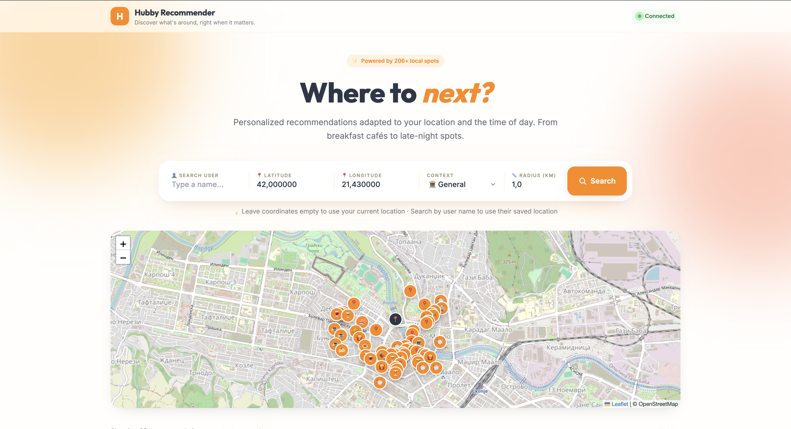
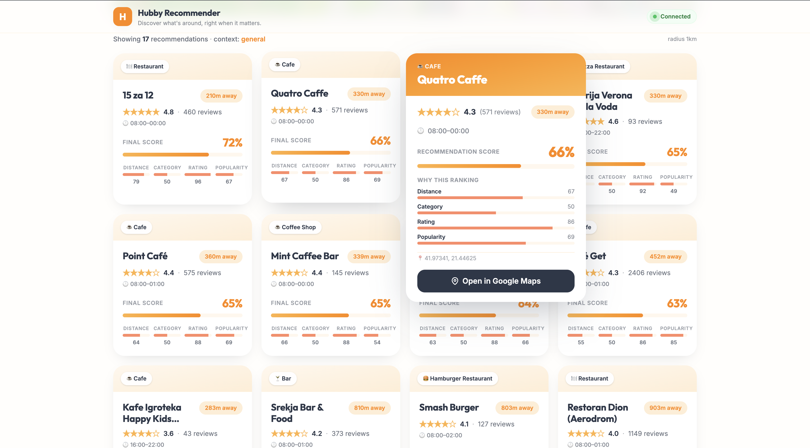

# 🧡 Hubby Recommender

> A context-aware, location-based travel recommendation system. Discover the right place at the right moment — restaurants, cafés, bars, and cultural sites — ranked by where you are and what time of day it is.

Built as the implementation of **Solution 2 — Discover Local Activities** at [Brainster Next College](https://brainster.co/next), for a real-world client: **[Hubby](https://hubby.com/)**, a Dutch eSIM company serving travelers across 200+ destinations.

---

## ✨ Why this exists

Hubby noticed a real problem: travelers use their eSIM app heavily on day one, then engagement drops. Their strategic vision is to turn the app into a **Travel Companion** — comparable to WeChat or Grab — where users do everything in one place.

Hubby Recommender is the first step in that direction. A feature that brings users back every time they're in a new city, hungry, lost, or simply curious about what's nearby.

---

## 📸 Preview


*The main interface — search bar, interactive map, and ranked recommendation cards with full score breakdowns.*


*Hovering any card reveals the full score breakdown and a one-click "Open in Google Maps" deep link to the actual venue.*

---

## 🎯 Features

- **Context-aware ranking** — recommendations adapt to the time of day. Cafés rank higher at breakfast; restaurants and bars rank higher at dinner; museums and attractions shine in *General* mode.
- **Five context modes** — Auto (inferred from current time), Breakfast, Lunch, General, Dinner, Nightlife.
- **Transparent scoring** — every result shows its full breakdown: distance, category fit, rating, and popularity. No black-box.
- **Three search modes** — by your current location (via browser geolocation), by manually entered coordinates, or by selecting a saved user profile from the database.
- **Interactive Leaflet map** — every recommendation appears as both a card and a pin. Click any pin for a polished popup.
- **Google Maps deep-link** — one click takes you to the actual venue in Google Maps, with name and coordinates.
- **Configurable radius** — search from 100 meters up to 20 kilometers.
- **Real data** — 206 activities sourced from the Google Places API for the Skopje area, plus ~70 dummy user profiles for testing.

---

## 🛠 Tech Stack

**Backend**
- Python 3.11
- FastAPI + Uvicorn
- SQLAlchemy + Pydantic
- PostgreSQL 16 (via Docker Compose)

**Frontend**
- HTML5 + Vanilla JavaScript (no build pipeline)
- Tailwind CSS (via CDN)
- Leaflet 1.9.4 + OpenStreetMap
- Google Fonts (Outfit + Inter)

**Tooling**
- Docker Compose, Git, Swagger UI

---

## 🚀 Quick Start

You'll need: Python 3.11+, Docker Desktop, Git.

```bash
# Clone
git clone https://github.com/lazarevskaana/hubby-recommender.git
cd hubby-recommender

# Backend setup
python3 -m venv venv
source venv/bin/activate
pip install -r requirements.txt
cp .env.example .env

# Database
docker compose up -d
python drop_and_recreate_tables.py
python preprocess_activities_tsv.py
python insert_activities.py
python generate_dummy_users.py
python insert_users.py

# Start the backend (Terminal 1)
uvicorn app.main:app --reload

# Start the frontend (Terminal 2)
cd frontend
python -m http.server 5500
```

Open **http://localhost:5500** in your browser. Allow geolocation, or it falls back to Skopje.

For the full step-by-step walkthrough, see [SETUP.md](SETUP.md).

---